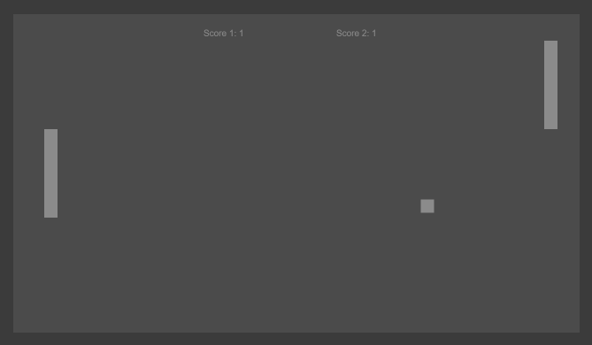

# Pong

## Sobre o projeto.
Pong é o primeiro videojogo lucrativo da história, dando origem a um novo setor da indústria. Foi de importância fundamental na história do videojogo. Foi criado por Nolan Bushnell e Ted Dabney na forma de um console ligado a um monitor, movido a moedas.

Data de conclusão: 10/12/2021

## Ferramentas e tecnologias usadas nesse projeto.
 
```js
function Pong(Project) {
    if (Front End) {
        const Stack = `${HTML}, ${CSS}`;
    } 
};
```
<br>

<div align="center">



</div>

---

> - Autores: 
>   - [Eduardo Kayke](https://github.com/EduardoKayke "Perfil do Eduardo")

- [Voltar ao perfil do Github.](https://github.com/EduardoKayke "Perfil do Eduardo")

_Um dia seremos a tecnologia. Biohacking a própria evolução de nós mesmos._
